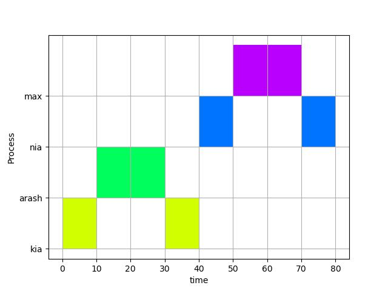

# Simple Gantt Chart Maker
A Gantt chart is a type of bar chart that illustrates a project schedule, named after its popularizer, Henry Gantt.
### example usage:
- Plotting CPU burst times for each process

## Sample input:
```py
# format: [(procName, startExecTime, burstTime)]
[('kia', 0, 10), ('arash', 10, 20), ('kia', 30, 10),
    ('nia', 40, 10), ('max', 50, 20), ('nia', 70, 10)]
```

## Sample output:

